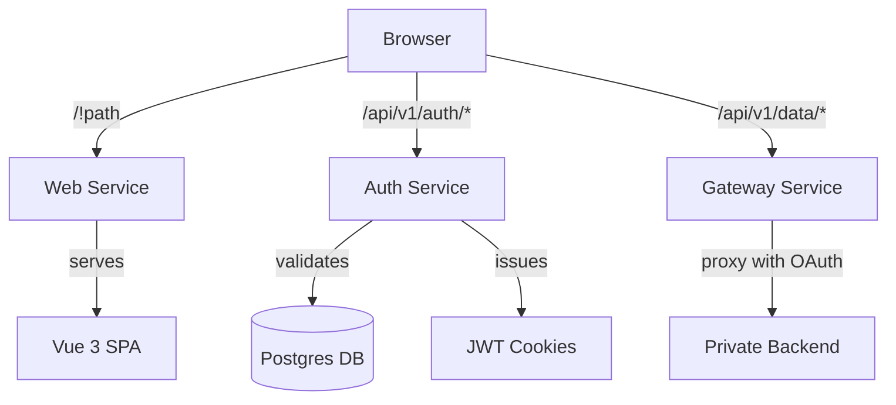

# Architecture Overview

**acme-vue-encore** is designed as a single-container deployable that bundles two Vue 3 SPAs with a robust Encore.ts backend. The architecture emphasizes stateless authentication, security invariants, and a Backend-for-Frontend (BFF) proxy pattern.

## Execution Flow

The system architecture relies on the Encore API serving both static assets and dynamic data requests.

## Single-Container Topology

Despite containing multiple logical components, the application is deployed as a single container.

1. The Vue SPAs are built during the deployment pipeline. The `build:web` command compiles the public SPA into `apps/api/web/build`.
2. The Encore `web` service uses `api.static` to serve these built assets.
3. The resulting Docker image runs the Encore application on port 4000, handling all incoming traffic.

This single-container approach eliminates the need for a separate static hosting provider, simplifying deployment and reducing cross-origin complexity.

## The API Surface

The backend exposes a structured API surface under the `/api/v1` prefix. This stable prefix ensures that OAuth redirect URIs and gateway contracts remain consistent.

- **`/api/v1/auth/*`**: Authentication endpoints, including login, callback, logout, and token refresh.
- **`/api/v1/data/*`**: The BFF gateway proxy, which forwards requests to the private backend.
- **`/api/v1/info`**: Application metadata.
- **`/api/v1/csp-report`**: A sink for Content Security Policy violation reports.
- **`/health`**: Composite liveness and readiness probes.

## Security Invariants

The architecture is strictly governed by eleven security and data invariants (INV-1 through INV-11), established in spec 002. These invariants mandate practices such as:

- Parameterized queries only (INV-2) to prevent SQL injection.
- Stateless JWT authentication in `httpOnly` cookies (INV-3).
- Redaction of Personally Identifiable Information (PII) from all logs (INV-11).

These invariants are enforced by the primitives in the `lib/` directory, ensuring that all services adhere to the security baseline.
